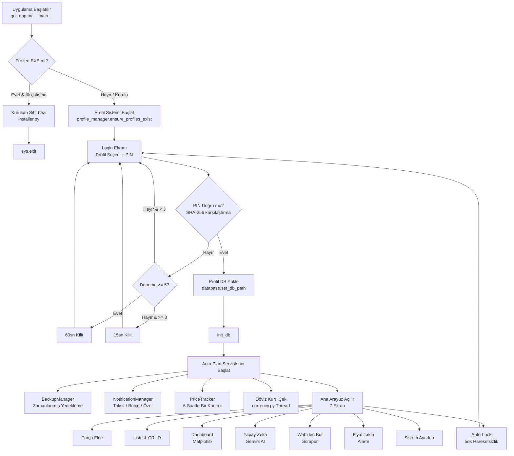
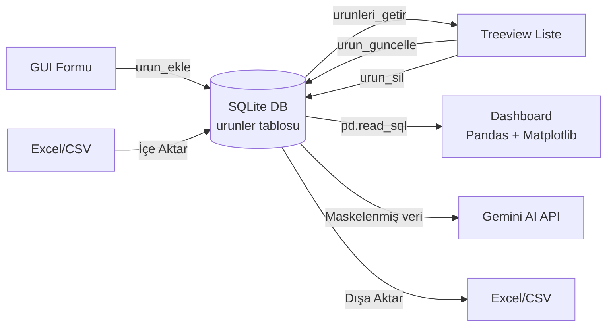
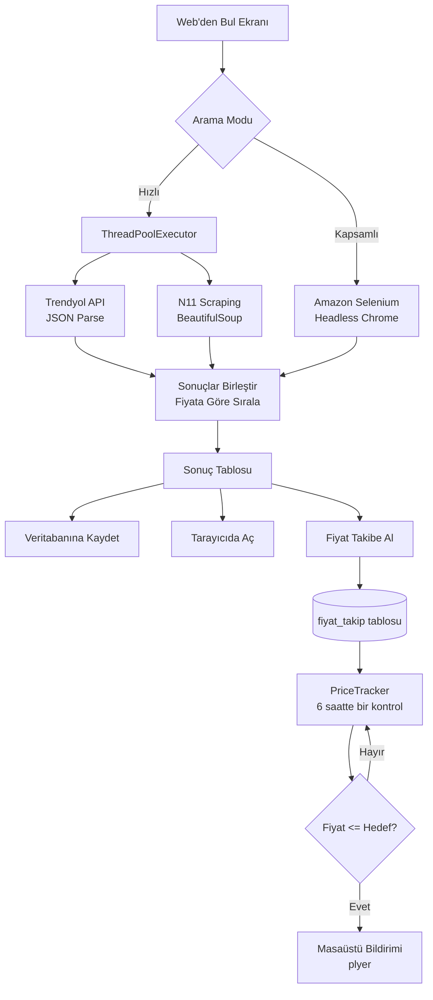
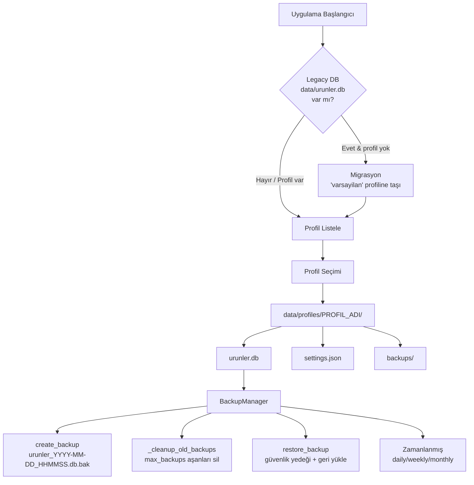
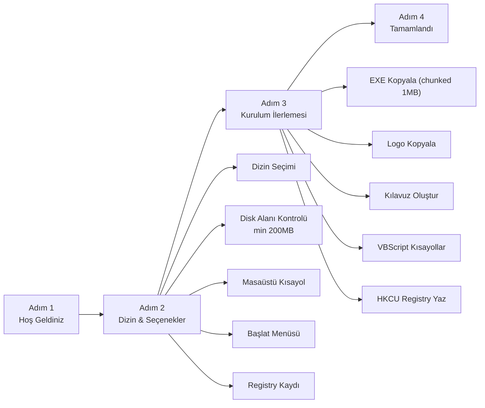

# TEKNIK_MIMARI.md - BütçeM Tam Teknik Dokümantasyonu

> **Sürüm:** 2.2.1 | **Son Güncelleme:** 2026-03-29 | **Toplam Kod:** ~3.900 satır (10 modül)

---

## 1. Proje Vizyonu & Algoritma

### 1.1 Kuruluş Amacı

**BütçeM**, kişisel finans yönetimini tek bir masaüstü uygulamasında birleştiren kapsamlı bir bütçe ve ürün takip asistanıdır. Projenin temel motivasyonu:

- Birden fazla kredi kartı taksiti, e-ticaret fiyat dalgalanmaları ve döviz kuru etkilerini **tek bir noktadan** izlemek
- E-ticaret sitelerinden **otomatik fiyat taraması** yaparak en uygun fiyatı bulmak
- **Google Gemini AI** ile harcama verilerini analiz edip kişiye özel tasarruf önerileri sunmak
- **Self-Installer** ile teknik bilgi gerektirmeden kurulum sağlamak

### 1.2 Temel Algoritmalar

#### PBKDF2 PIN Güvenlik Algoritması

```
Kullanıcı PIN girer (min 6 karakter)
        |
        v
PIN --> PBKDF2-HMAC-SHA256 (100.000 iterasyon, random salt)
        |
        v
Format: "salt$hash" (settings.json'da saklanır)
        |
        v
verify_pin(): salt ayır, aynı salt ile hash hesapla
        |
secrets.compare_digest() ile karşılaştır (timing-safe)
       / \
     Evet  Hayır
      |      |
      v      v
   Giriş   Sayac++ (dosyaya kaydedilir)
   başarılı  3 hata -> 15sn kilit
   (eski     5 hata -> 60sn kilit
   SHA-256   (restart ile sıfırlanmaz)
   auto-
   migrate)
```

**Neden PBKDF2?** Salt ile rainbow table koruması, 100K iterasyon ile brute force yavaşlatma. Eski SHA-256 hash'ler başarılı girişte otomatik PBKDF2'ye yükseltilir.

#### Finansal Hesaplama Motoru

```
Nakit Ödeme (taksit_sayisi = 0):
  Toplam Maliyet = Fiyat

Taksitli Ödeme (taksit_sayisi >= 2):
  Toplam Maliyet  = Fiyat + Vade Farkı
  Aylık Taksit    = Toplam Maliyet / Taksit Sayısı
  Ödenen Tutar    = Ödenen Taksit × Aylık Taksit
  Kalan Borç      = Toplam Maliyet - Ödenen Tutar
```

#### AI Veri Maskeleme Algoritması

```
Veritabanı  : "iPhone 15 Pro, 64.999 TL, Elektronik"
                        |
                        v  (maskeleme)
Gemini'ye   : "Ürün 1, 64.999 TL, Elektronik"
```

Ürün isimleri `Ürün {idx+1}` şeklinde maskelenerek Gemini API'ye gönderilir. Sadece kategori ve fiyat bilgisi paylaşılır.

#### Auto-Lock Mekanizması

```
Fare/Klavye hareketi --> last_activity = time.time()
        |
Her 5 saniyede kontrol (self.after(5000)):
  time.time() - last_activity > 300 saniye?
       / \
     Hayır  Evet
      |       |
   Devam   Ekran kilitlenir
            PIN ekranı açılır
```

#### Web Arama & Fiyat Sıralama Algoritması

```
Kullanıcı arama yapar
        |
        v
  mod == "hizli" ?
       / \
     Evet  Hayır (kapsamli)
      |       |
      v       v
 ThreadPoolExecutor(2)   Selenium Headless Chrome
 Trendyol + N11 paralel   Amazon.com.tr tarama
      |                       |
      v                       v
 Sonuçlar birleştirilir
        |
        v
 sorted(key=lambda x: x['fiyat'])  --> Ucuzdan pahalıya sıralı liste
```

---

## 2. Akış Diyagramları

### 2.1 Ana Uygulama Akışı



### 2.2 Veritabanı CRUD Akışı



### 2.3 Web Scraping & Fiyat Takip Akışı



### 2.4 Profil ve Yedekleme Sistemi



### 2.5 Kurulum Sihirbazı Akışı



---

## 3. Klasör Yapısı

```
urun-takip/
│
├── gui_app.py              # Ana uygulama - 7 ekranlı GUI (1624 satır)
│                            # App sınıfı, tüm ekranlar, iş mantığı, güvenlik
│
├── database.py             # Veritabanı katmanı (195 satır)
│                            # SQLite CRUD, migration, dinamik DB yolu, fiyat takip CRUD
│
├── web_scraper.py          # E-ticaret bot motoru (213 satır)
│                            # Trendyol API, N11 BS4, Amazon Selenium, paralel arama
│
├── profile_manager.py      # Çoklu kullanıcı profil sistemi (265 satır)
│                            # Profil CRUD, ayarlar, legacy migrasyon, PIN yönetimi
│
├── backup_manager.py       # Otomatik yedekleme sistemi (135 satır)
│                            # Zamanlanmış yedek, cleanup, geri yükleme
│
├── notification_manager.py # Masaüstü bildirim sistemi (137 satır)
│                            # Taksit hatırlatma, bütçe uyarısı, aylık özet
│
├── price_tracker.py        # Fiyat takip & alarm motoru (82 satır)
│                            # Periyodik fiyat kontrolü, hedef fiyat bildirimi
│
├── currency.py             # Döviz kuru modülü (32 satır)
│                            # USD/TRY, EUR/TRY - 1 saat cache TTL
│
├── installer.py            # Kurulum sihirbazı & kaldırma (786 satır)
│                            # 4 adımlı wizard, registry, VBScript kısayol, uninstall
│
├── smoke_test.py           # Otomatik test paketi (252 satır)
│                            # 8 modül, 14 test - %100 başarı
│
├── requirements.txt        # Python bağımlılıkları (11 paket)
├── BütçeM.spec             # PyInstaller build konfigürasyonu
├── .env.example            # Ortam değişkenleri şablonu
├── .env                    # Gerçek ortam değişkenleri (gitignore'da)
├── .gitignore              # Git hariç tutma kuralları
├── logo.ico                # Uygulama ikonu (93KB)
├── README.md               # Proje tanıtım dokümanı
├── GAMMA_SUNUM.md          # 14 slaytlık sunum içeriği
│
├── data/                   # Kullanıcı verileri (gitignore'da)
│   ├── profiles.json       # Profil indeks dosyası
│   └── profiles/           # Profil dizinleri
│       └── {profil_adi}/
│           ├── urunler.db      # SQLite veritabanı
│           ├── settings.json   # Profil ayarları (PIN hash, tema, bildirim, yedek)
│           └── backups/        # Otomatik yedekler
│               └── urunler_YYYY-MM-DD_HHMMSS.db.bak
│
├── build/                  # PyInstaller build çıktıları (gitignore'da)
│   └── BütçeM/
│
└── dist/                   # Derlenmiş EXE (gitignore'da)
    └── BütçeM.exe
```

---

## 4. Teknoloji Yığını

### 4.1 Çekirdek

| Teknoloji | Sürüm | Kullanım Amacı | Kullanıldığı Modül |
|-----------|-------|----------------|-------------------|
| **Python** | 3.12+ | Ana geliştirme dili | Tüm modüller |
| **CustomTkinter** | >=5.2.0 | Modern görünümlü masaüstü GUI framework | `gui_app.py`, `installer.py` |
| **SQLite3** | Built-in | Gömülü ilişkisel veritabanı (profil başına ayrı) | `database.py` |

### 4.2 Veri Analizi & Görselleştirme

| Teknoloji | Sürüm | Kullanım Amacı | Kullanıldığı Modül |
|-----------|-------|----------------|-------------------|
| **Pandas** | >=2.0.0 | DataFrame ile veri işleme, gruplama, filtreleme | `gui_app.py` (Dashboard, AI, Import/Export) |
| **Matplotlib** | >=3.7.0 | Pasta grafiği ve birikimli çizgi grafiği oluşturma | `gui_app.py` (Dashboard) |
| **OpenPyXL** | >=3.1.0 | Excel dosyası okuma/yazma (.xlsx format) | `gui_app.py` (Import/Export) |

### 4.3 Web Scraping & API

| Teknoloji | Sürüm | Kullanım Amacı | Kullanıldığı Modül |
|-----------|-------|----------------|-------------------|
| **Requests** | >=2.31.0 | HTTP istekleri (Trendyol API, N11 HTML) | `web_scraper.py` |
| **BeautifulSoup4** | >=4.12.0 | HTML parse (N11, tekil fiyat çekme) | `web_scraper.py` |
| **Selenium** | >=4.15.0 | Headless Chrome tarayıcı otomasyonu (Amazon) | `web_scraper.py` |
| **webdriver-manager** | >=4.0.0 | ChromeDriver otomatik indirme ve yönetme | `web_scraper.py` |
| **google-generativeai** | >=0.3.0 | Gemini AI API entegrasyonu (gemini-1.5-flash) | `gui_app.py` (AI Danışman) |

### 4.4 Bildirim & Otomasyon

| Teknoloji | Sürüm | Kullanım Amacı | Kullanıldığı Modül |
|-----------|-------|----------------|-------------------|
| **Plyer** | >=2.1.0 | Windows masaüstü toast bildirimleri | `notification_manager.py` |
| **threading.Timer** | Built-in | Zamanlanmış arka plan görevleri | `backup_manager.py`, `notification_manager.py`, `price_tracker.py` |
| **concurrent.futures** | Built-in | ThreadPoolExecutor ile paralel web arama | `web_scraper.py` |

### 4.5 Güvenlik & Altyapı

| Teknoloji | Sürüm | Kullanım Amacı | Kullanıldığı Modül |
|-----------|-------|----------------|-------------------|
| **hashlib (SHA-256)** | Built-in | PIN şifreleme (düz metin saklanmaz) | `gui_app.py`, `profile_manager.py` |
| **python-dotenv** | >=1.0.0 | `.env` dosyasından ortam değişkeni yönetimi | `gui_app.py` |
| **PyInstaller** | Build-time | Tek dosya EXE derleme | `BütçeM.spec` |
| **VBScript** | Windows | Masaüstü/Başlat menüsü kısayol oluşturma | `installer.py` |
| **winreg** | Built-in | Windows Registry (Programlar ve Özellikler) | `installer.py` |

---

## 5. Veritabanı Şeması

### 5.1 `urunler` Tablosu

| Sütun | Tip | Varsayılan | Açıklama |
|-------|-----|-----------|----------|
| `id` | INTEGER | AUTO_INCREMENT | Birincil anahtar |
| `kategori` | TEXT | NOT NULL | Ürün kategorisi (Elektronik, Giyim vb.) |
| `urun_adi` | TEXT | NOT NULL | Ürün ismi |
| `fiyat` | REAL | NOT NULL | Baz fiyat (TL) |
| `durum` | TEXT | NOT NULL | Alındı durumu (Evet/Hayır) |
| `link` | TEXT | '' | Ürün URL'si |
| `taksit_sayisi` | INTEGER | 1 | Taksit adedi (0=nakit, >=2=taksitli) |
| `vade_farki` | REAL | 0.0 | Vade farkı / faiz tutarı (TL) |
| `odenen_taksit` | INTEGER | 0 | Şu ana kadar ödenen taksit sayısı |
| `ekleme_tarihi` | TEXT | '' | ISO format tarih (YYYY-MM-DD) |

### 5.2 `fiyat_takip` Tablosu

| Sütun | Tip | Varsayılan | Açıklama |
|-------|-----|-----------|----------|
| `id` | INTEGER | AUTO_INCREMENT | Birincil anahtar |
| `url` | TEXT | NOT NULL | Ürün sayfası URL'si |
| `urun_adi` | TEXT | NOT NULL | Takip edilen ürün adı |
| `platform` | TEXT | NOT NULL | E-ticaret platformu (Trendyol/N11/Diğer) |
| `hedef_fiyat` | REAL | NOT NULL | Hedef fiyat eşiği (TL) |
| `mevcut_fiyat` | REAL | 0.0 | Son çekilen güncel fiyat |
| `son_kontrol` | TEXT | '' | Son kontrol zamanı |
| `aktif` | INTEGER | 1 | Takip durumu (1=aktif, 0=durduruldu) |

### 5.3 Profil Settings JSON Yapısı

```json
{
  "pin_hash": "sha256_hex_digest_64_karakter",
  "theme": "Dark",
  "monthly_budget": 0,
  "notifications": {
    "taksit_reminder": true,
    "budget_warning": true,
    "monthly_summary": true
  },
  "backup": {
    "enabled": false,
    "interval": "weekly",
    "max_backups": 5,
    "custom_dir": ""
  }
}
```

---

## 6. Fonksiyon Rehberi

### 6.1 database.py - Veritabanı Katmanı

| Fonksiyon | Parametreler | Açıklama |
|-----------|-------------|----------|
| `set_db_path(path)` | `path: str` | Global DB_PATH değişkenini ayarlar. Profil bazlı çalışmayı mümkün kılar. |
| `get_connection()` | - | Merkezi SQLite bağlantı fabrikası. Tüm CRUD fonksiyonları bunu kullanır. DB_PATH None ise RuntimeError fırlatır. |
| `init_db()` | - | `urunler`, `kategoriler` ve `fiyat_takip` tablolarını oluşturur. Eksik sütunları ALTER TABLE ile ekler (migration). |
| `urun_ekle(kategori, urun_adi, fiyat, durum, link, taksit_sayisi, vade_farki, odenen_taksit, ekleme_tarihi)` | 9 parametre | Yeni ürün kaydı oluşturur. `ekleme_tarihi` boşsa bugünün tarihini atar. |
| `urunleri_getir(kategori_filtre, arama_filtre)` | İsteğe bağlı filtreler | Ürün listesini döndürür. Kategori ve/veya ürün adı araması destekler. Parametrik sorgulama (SQL injection koruması). |
| `urun_sil(urun_id)` | `urun_id: int` | ID'ye göre ürün siler. |
| `urun_guncelle(urun_id, ...)` | 9 parametre | Mevcut ürünü günceller. |
| `get_monthly_spending(year, month)` | `year: int, month: int` | Belirli ayda "Evet/Alındı" durumundaki ürünlerin toplam harcamasını döndürür (fiyat + vade farkı). |
| `takip_ekle(url, urun_adi, platform, hedef_fiyat, mevcut_fiyat)` | 5 parametre | Yeni fiyat takip kaydı oluşturur. |
| `takip_listele(sadece_aktif)` | `sadece_aktif: bool` | Fiyat takip listesini döndürür. |
| `takip_guncelle(takip_id, mevcut_fiyat, son_kontrol)` | 3 parametre | Takip kaydının fiyat ve kontrol zamanını günceller. |
| `takip_sil(takip_id)` | `takip_id: int` | Takip kaydını siler. |
| `takip_duraklat(takip_id, aktif)` | `takip_id: int, aktif: bool` | Takibi durdurur veya devam ettirir. |
| `kategori_ekle(ad)` | `ad: str` | Yeni kategori ekler. Zaten varsa yoksayar (INSERT OR IGNORE). |
| `kategorileri_getir()` | - | Tüm kategorileri döndürür (kategoriler tablosu + ürünlerdeki UNION). Boşsa `["Diğer"]` döner. |
| `kategori_sil(ad)` | `ad: str` | Kategoriyi kategoriler tablosundan siler. |
| `kategori_guncelle(eski_ad, yeni_ad)` | `eski_ad, yeni_ad: str` | Kategori adını hem kategoriler hem ürünler tablosunda günceller. |
| `kategori_urun_sayisi(ad)` | `ad: str` | Belirtilen kategorideki ürün sayısını döndürür. |

### 6.2 gui_app.py - Ana Uygulama (App Sınıfı)

| Metot | Açıklama |
|-------|----------|
| `__init__()` | Ana pencere oluşturur (1050x700). Sidebar menü, 7 navigasyon butonu, döviz kuru etiketi. `withdraw()` ile gizler, login'e yönlendirir. |
| `show_login_screen()` | Toplevel login penceresi. Profil ComboBox + PIN Entry + Yeni Profil butonu. |
| `check_pin(login_win)` | SHA-256 hash karşılaştırması. Başarılıysa profil DB yükler, arka plan servislerini başlatır. Başarısızsa kademeli kilit. |
| `_start_background_managers(settings)` | BackupManager, NotificationManager ve PriceTracker'ı başlatır. |
| `start_autolock()` / `check_autolock()` | Fare/klavye hareketi izler. 300sn hareketsizlikte PIN ekranına döner. |
| `load_currency()` | Thread ile `currency.get_exchange_rates()` çağırır. Sidebar'daki USD/EUR etiketini günceller. |
| `show_ekle_frame()` | Ürün ekleme formu: Kategori (ComboBox), Ad, Fiyat, Durum, Link, Nakit/Taksitli radio, taksit alanları. |
| `kaydet_veriler()` | Form validasyonu + `database.urun_ekle()`. Fiyat > 0, taksit >= 2 kontrolleri. |
| `show_liste_frame()` | Treeview tablosu + filtre/arama + özet satır. ID, Kategori, Ad, Maliyet, Durum, Ödeme kolonları. |
| `load_treeview_data()` | Filtreye göre verileri çeker, Treeview'ı doldurur. Harcanan/Bekleyen/Toplam bütçeyi hesaplar. USD karşılığı gösterir. |
| `guncelle_popup()` | Seçili kaydı Toplevel popup'ta düzenleme formu. Kategori ComboBox ile mevcut kategoriler listelenir. Nakit/Taksitli geçiş desteği. |
| `sil_kayit()` | Onay dialoguyla seçili kaydı siler. |
| `excel_disa_aktar()` | Treeview verilerini .xlsx veya .csv olarak dışa aktarır. `pd.DataFrame.to_excel()`. |
| `verileri_ice_aktar()` | Excel/CSV dosyasını okur, önizleme tablosu gösterir, onay sonrası toplu kayıt yapar. 10MB / 10.000 satır limiti. |
| `show_dashboard_frame()` | Matplotlib ile pasta grafiği (kategori bazlı) ve birikimli çizgi grafiği. `pd.read_sql()` ile veri çeker. |
| `show_ai_frame()` / `get_ai_response()` | Gemini AI entegrasyonu. Verileri maskeler, prompt oluşturur, `gemini-1.5-flash` modeline gönderir. |
| `show_web_frame()` / `web_arama_baslat()` | Hızlı (Trendyol+N11) veya Kapsamlı (Amazon Selenium) arama. Thread ile arka planda çalışır. |
| `web_db_ekle()` | Web sonuçlarından Hızlı Kayıt popup'ı. Kategori, durum, taksit desteği. |
| `web_fiyat_takip_ekle()` | Seçili web ürünü için fiyat takip ekler. Varsayılan hedef: mevcut fiyatın %90'ı. |
| `show_fiyat_takip_frame()` | Fiyat takip yönetim ekranı. URL+Ad+Platform+Hedef ile yeni takip ekleme. Kontrol et / Durdur / Devam / Sil butonları. |
| `show_ayarlar_frame()` | Tema, Kategori Yönetimi, PIN, Yedekleme, Otomatik Yedekleme, Bildirimler, Profil Yönetimi, API Key bölümleri. |
| `_show_kategori_yonetimi()` | Kategori Yönetimi popup penceresi. Mevcut kategorileri listeler, yeni ekleme (Entry), düzenleme (InputDialog), silme (ürün sayısı uyarılı) destekler. |

### 6.3 web_scraper.py - E-Ticaret Bot Motoru

| Fonksiyon | Parametreler | Açıklama |
|-----------|-------------|----------|
| `_retry(func, kelime, max_retries, delay)` | İşlev, arama kelimesi | Sonuç boşsa 2 kez tekrar dener. 1sn bekleme ile. |
| `trendyol_arama(kelime)` | `kelime: str` | Trendyol public JSON API'den ilk 20 ürünü çeker. 5sn timeout. |
| `n11_arama(kelime)` | `kelime: str` | N11 HTML sayfasını BS4 ile parse eder. `li.column` içindeki h3, ins/a.newPrice, a.plink elemanları. |
| `amazon_arama_selenium(kelime)` | `kelime: str` | Headless Chrome ile Amazon.com.tr'de arama yapar. İlk 15 ürün. `div[data-component-type='s-search-result']`. |
| `urun_ara(kelime, mode)` | `kelime: str, mode: str` | `hizli`: Trendyol+N11 paralel. `kapsamli`: Amazon Selenium. Sonuçları fiyata göre sıralar. |
| `trendyol_fiyat_getir(url)` | `url: str` | Tekil Trendyol ürünü fiyatını çeker (`span.prc-dsc` veya `span.prc-slg`). |
| `n11_fiyat_getir(url)` | `url: str` | Tekil N11 ürünü fiyatını çeker. |
| `fiyat_getir(url, platform)` | `url: str, platform: str` | Platform'a göre doğru fiyat çekme fonksiyonunu yönlendirir. |

### 6.4 profile_manager.py - Profil Yönetim Sistemi

| Fonksiyon | Parametreler | Açıklama |
|-----------|-------------|----------|
| `get_base_dir()` | - | Script veya frozen exe uyumlu kök dizin. |
| `list_profiles()` | - | `[{"name": str, "created": str}]` listesi döndürür. |
| `create_profile(name, pin)` | `name: str, pin: str` | Yeni profil dizini + boş DB + settings.json oluşturur. İsim sanitize edilir (alfanümerik + boşluk/alt çizgi/tire). |
| `delete_profile(name)` | `name: str` | Profili siler. Son profil silinemez (ValueError). `shutil.rmtree()`. |
| `rename_profile(old_name, new_name)` | 2 str | Dizin ve index'i yeniden adlandırır. |
| `get_profile_db_path(name)` | `name: str` | `data/profiles/{name}/urunler.db` yolunu döndürür. |
| `load_profile_settings(name)` | `name: str` | JSON ayarları yükler. Eksik anahtarları varsayılanlarla doldurur. |
| `save_profile_settings(name, settings)` | `name: str, settings: dict` | Ayarları JSON olarak kaydeder. |
| `migrate_legacy_data()` | - | Tek seferlik: eski `data/urunler.db`'yi 'varsayilan' profiline taşır. Eski PIN'i .env'den alır. |
| `ensure_profiles_exist()` | - | Migration çalıştırır. Profil yoksa 'varsayilan' oluşturur. |

### 6.5 backup_manager.py - BackupManager Sınıfı

| Metot | Parametreler | Açıklama |
|-------|-------------|----------|
| `__init__(profile_name, backup_settings)` | Profil adı, ayar dict'i | Timer ve ayarları başlatır. |
| `get_backup_dir()` | - | Özel dizin ayarlıysa onu, yoksa `profiles/{name}/backups/` döndürür. Sistem dizinlerine yazma engeli (path traversal koruması). |
| `create_backup()` | - | DB'yi `urunler_YYYY-MM-DD_HHMMSS.db.bak` olarak kopyalar. `shutil.copy` kullanır (mtime sorununu önler). Sonra cleanup çalıştırır. |
| `_cleanup_old_backups()` | - | `max_backups` sayısını aşan eski yedekleri siler. Dosya adına göre sıralama (kronolojik format garantili). |
| `list_backups()` | - | `[{"filename", "path", "size_kb", "created"}]` listesi. Tarihe göre azalan sıra. |
| `restore_backup(backup_path)` | `backup_path: str` | Path doğrulaması yapar (sadece backup dizininden, .db.bak uzantılı). Önce güvenlik yedeği alır, sonra geri yükler. |
| `start_scheduled()` / `stop_scheduled()` | - | threading.Timer ile periyodik yedekleme. `daily=86400s`, `weekly=604800s`, `monthly=2592000s`. |

### 6.6 notification_manager.py - NotificationManager Sınıfı

| Metot | Parametreler | Açıklama |
|-------|-------------|----------|
| `send_notification(title, message, timeout)` | 3 parametre | `plyer.notification.notify()` ile Windows toast bildirimi. |
| `check_installment_reminders()` | - | `taksit_sayisi >= 2` ve `odenen_taksit < taksit_sayisi` olan ürünleri bildirir. İlk 5 ürün + "ve X ürün daha". |
| `check_budget_warnings()` | - | `get_monthly_spending()` ile aylık harcamayı kontrol eder. %80'de uyarı, %100'de alarm. |
| `generate_monthly_summary()` | - | Ayın ilk 3 gününde önceki ayın toplam harcamasını bildirir. |
| `start_periodic_checks()` / `stop_periodic_checks()` | - | 1 saatte bir tüm bildirimleri kontrol eder. |
| `run_startup_checks()` | - | Uygulama açılışında tek seferlik thread ile kontrol başlatır. |

### 6.7 price_tracker.py - PriceTracker Sınıfı

| Metot | Parametreler | Açıklama |
|-------|-------------|----------|
| `__init__(notification_manager, check_interval_hours)` | NM referansı, saat cinsinden aralık (varsayılan 6) | |
| `check_single_item(url, platform)` | URL ve platform adı | `web_scraper.fiyat_getir()` ile tekil fiyat çeker. |
| `check_all_tracked_items()` | - | Tüm aktif takip kayıtlarını kontrol eder. Fiyat <= hedef ise bildirim gönderir. |
| `add_tracking(url, urun_adi, platform, hedef_fiyat, mevcut_fiyat)` | 5 parametre | `database.takip_ekle()` wrapper. |
| `start_periodic_checks()` / `stop_periodic_checks()` | - | 6 saatte bir `check_all_tracked_items()` çalıştırır. |

### 6.8 currency.py - Döviz Kuru

| Fonksiyon | Parametreler | Açıklama |
|-----------|-------------|----------|
| `get_exchange_rates()` | - | ExchangeRate API'den USD/TRY ve EUR/TRY çeker. 1 saat cache (TTL=3600s). Hata durumunda eski cache kullanır (stale fallback). Tamamen başarısızsa `{"USD": 0.0, "EUR": 0.0}`. |

### 6.9 installer.py - Kurulum & Kaldırma

| Fonksiyon/Sınıf | Açıklama |
|-----------------|----------|
| `should_show_installer()` | Frozen exe + ilk çalışma kontrolü. `.butcem_installed` marker dosyasına bakar. |
| `_register_program(install_dir, exe_path)` | Önce HKLM, sonra HKCU Registry'ye program bilgisi yazar. `QuietUninstallString` dahil. `(bool, str)` tuple döndürür. |
| `_verify_registry()` | Registry kaydının doğruluğunu kontrol eder. `(hive_name, display_name)` veya `None` döndürür. |
| `_unregister_program()` | Registry kaydını siler (her iki konumdan). |
| `_hide_file(path)` | Windows Hidden attribute ile dosya/dizin gizler. Marker ve log dosyaları için kullanılır. |
| `_create_shortcuts(install_dir, target_path, desktop, startmenu)` | VBScript ile .lnk kısayolları oluşturur. UTF-16LE encoding (Türkçe karakter desteği). |
| `_delete_shortcuts()` | Masaüstü ve Başlat menüsü kısayollarını siler. |
| `_check_disk_space(path)` | `shutil.disk_usage()` ile boş disk alanını MB cinsinden döndürür. |
| `_write_install_log(install_dir, options)` | `install_log.txt` günlüğü yazar. |
| `_kilavuz_metni()` | A'dan Z'ye kullanım kılavuzu metni döndürür. |
| `baslat_kurulum_modu()` | 4 adımlı wizard: Hoş Geldiniz -> Dizin -> Kurulum (chunked copy) -> Tamamlandı. |
| `KurulumSihirbazi` (sınıf referansı) | `baslat_kurulum_modu` fonksiyonu ile eşdeğer. |
| `baslat_kaldir_modu()` | `--uninstall` flag'i ile çağrılır. Kısayol sil + Registry temizle + batch ile delayed exe delete. |
| `show_uninstall_button_in_app(parent_frame, app)` | Sistem Ayarları'na "Programı Kaldır" butonu ekler (sadece frozen modda). |

---

## 7. Güvenlik Mimarisi

| Katman | Mekanizma | Detay |
|--------|-----------|-------|
| **PIN Koruması** | PBKDF2-SHA256 + salt | 100.000 iterasyon, rastgele 16-byte salt. Format: `salt$hash`. Eski SHA-256 hash otomatik migrate edilir. Min 6 karakter. |
| **Brute Force** | Kademeli kilitleme (persist) | 3 hata: 15sn, 5 hata: 60sn. Kilit durumu `settings.json`'a yazılır (restart ile sıfırlanmaz). |
| **Auto-Lock** | 5dk hareketsizlik | `bind_all("<Motion>")` ve `bind_all("<Key>")` ile izleme. |
| **SQL Injection** | Parametrik sorgulama + LIKE escape | Tüm SQL sorguları `?` placeholder kullanır. LIKE pattern özel karakterleri (`%`, `_`) escape edilir. |
| **Command Injection** | VBScript/Batch escape | Kısayol oluşturmada VBScript string escape, kaldırmada batch özel karakter escape uygulanır. |
| **Input Validation** | Kategori: 50 karakter, alfanumerik + sınırlı özel karakter | Tüm kullanıcı girdileri uzunluk ve karakter kısıtlamalarıyla doğrulanır. |
| **Rate Limiting** | Web scraping minimum 2sn aralık | Aynı anda birden fazla arama engellenir, IP ban riski azaltılır. |
| **API Key** | `.env` dosyası | Kaynak kodda asla sabit API anahtarı yok. `python-dotenv` ile yönetim. |
| **AI Gizliliği** | Veri maskeleme | Ürün isimleri `Ürün {N}` olarak maskelenir. Gemini'ye sadece kategori + fiyat gider. |
| **Profil İzolasyonu** | Ayrı DB + settings | Her profil kendi dizininde (`data/profiles/{name}/`) izole çalışır. |
| **Backup Güvenliği** | Path traversal koruması | Özel yedekleme dizini sistem dizinlerine (Windows, Program Files) yazamaz. |
| **Loglama** | Dinamik seviye | Geliştirme: DEBUG, Üretim (frozen): INFO. Hassas veri sızıntısı önlenir. |

---

## 8. Arka Plan Servis Mimarisi

Uygulama başlatıldıktan sonra 4 daemon thread sürekli çalışır:

```
┌──────────────────────────────────────────────────────────┐
│                     ANA GUI THREAD                        │
│                    (Tkinter mainloop)                      │
├──────────────────────────────────────────────────────────┤
│                                                           │
│  Thread 1: Döviz Kuru                                     │
│  ├─ currency.get_exchange_rates()                         │
│  └─ Tek seferlik, sonuç lbl_kur'a yazılır                │
│                                                           │
│  Thread 2: BackupManager (threading.Timer)                │
│  ├─ create_backup() -> cleanup_old_backups()              │
│  └─ Periyod: daily(24h) / weekly(7d) / monthly(30d)      │
│                                                           │
│  Thread 3: NotificationManager (threading.Timer)          │
│  ├─ check_installment_reminders()                         │
│  ├─ check_budget_warnings()                               │
│  ├─ generate_monthly_summary()                            │
│  └─ Periyod: 1 saat (3600s)                              │
│                                                           │
│  Thread 4: PriceTracker (threading.Timer)                 │
│  ├─ check_all_tracked_items()                             │
│  │   └─ web_scraper.fiyat_getir() per item               │
│  └─ Periyod: 6 saat (21600s)                             │
│                                                           │
│  Thread 5+ (Geçici): Web Arama                            │
│  ├─ web_scraper.urun_ara() -> ThreadPoolExecutor          │
│  └─ Arama bitince self.after(0, ekrana_bas)               │
│                                                           │
└──────────────────────────────────────────────────────────┘
```

Tüm daemon thread'ler `self.timer.daemon = True` ile işaretlenir. Ana pencere kapanınca (`_on_close`) tüm Timer'lar `stop_scheduled()` / `stop_periodic_checks()` ile durdurulur.

---

## 9. Dış Servis Entegrasyonları

```
┌─────────────┐
│   BütçeM    │
│  Uygulaması │
└──────┬──────┘
       │
       ├──► Gemini AI API (HTTPS/JSON)
       │    Model: gemini-1.5-flash
       │    Yetkilendirme: Kullanıcı API key (.env)
       │    Veri: Maskelenmiş harcama özeti
       │    Yanıt: Finansal analiz + tasarruf önerileri
       │
       ├──► ExchangeRate API (HTTPS/JSON)
       │    Endpoint: api.exchangerate-api.com/v4/latest/{USD,EUR}
       │    Yetkilendirme: Gerekmiyor (ücretsiz)
       │    Cache: 1 saat TTL, stale fallback
       │
       ├──► Trendyol Public API (HTTPS/JSON)
       │    Endpoint: public.trendyol.com/discovery-web-searchgw-service/v2/api/infinite-scroll/sr
       │    Yöntem: GET + query parameter
       │    Limit: İlk 20 ürün, 5sn timeout
       │
       ├──► N11.com (HTTPS/HTML)
       │    Endpoint: www.n11.com/arama?q=
       │    Yöntem: BeautifulSoup4 HTML parse
       │    Limit: İlk 20 ürün, 5sn timeout
       │
       └──► Amazon.com.tr (Headless Chrome)
            Yöntem: Selenium WebDriver
            Limit: İlk 15 ürün, 15sn page load timeout
            Not: Bot koruması nedeniyle kapsamlı modda
```

---

## 10. Build & Dağıtım

### 10.1 PyInstaller Konfigürasyonu (`BütçeM.spec`)

```python
# Ana giriş noktası
Analysis(['gui_app.py'])

# Dahil edilen veri dosyaları
datas=[('logo.ico', '.')]

# Gizli import'lar (dinamik yüklenen modüller)
hiddenimports=[
    'customtkinter',
    'google.generativeai',
    'selenium',
    'openpyxl',
    'plyer', 'plyer.platforms', 'plyer.platforms.win',
    'plyer.platforms.win.notification'
]

# Tek dosya EXE, konsol penceresi yok
exe = EXE(..., name='BütçeM', console=False, icon=['logo.ico'], upx=True)
```

### 10.2 Build Komutu

```bash
pyinstaller BütçeM.spec
# Çıktı: dist/BütçeM.exe
```

### 10.3 Uygulama Giriş Noktası (`gui_app.py:1611-1624`)

```python
if __name__ == "__main__":
    # 1. --uninstall flag'i kontrolü
    if "--uninstall" in sys.argv:
        installer.baslat_kaldir_modu()
        sys.exit(0)

    # 2. İlk çalışmada kurulum sihirbazı
    if getattr(sys, 'frozen', False) and installer.should_show_installer():
        installer.baslat_kurulum_modu()
        sys.exit(0)

    # 3. Normal uygulama başlatma
    app = App()
    app.mainloop()
```

---

## 11. Test Altyapısı

### smoke_test.py - 8 Modül, 14 Test

| # | Modül | Test | Açıklama |
|---|-------|------|----------|
| 1 | database.py | `set_db_path` | Dinamik DB yolu ayarlama |
| 2 | database.py | `get_connection` | SQLite bağlantı kontrolü |
| 3 | database.py | `init_db + tablolar` | Tablo oluşturma doğrulama |
| 4 | database.py | `CRUD (ekle/güncelle/sil)` | Tam CRUD döngüsü |
| 5 | database.py | `get_monthly_spending` | Aylık harcama hesaplama |
| 6 | database.py | `fiyat_takip CRUD` | Fiyat takip ekle/güncelle/duraklat/sil |
| 7 | currency.py | `get_exchange_rates` | Döviz kuru dict yapısı kontrolü |
| 8 | profile_manager.py | `create/list/delete profil` | Geçici dizinde profil CRUD |
| 9 | profile_manager.py | `load/save settings` | Ayar kaydetme/yükleme + değer kalıcılığı |
| 10 | backup_manager.py | `create/list backup` | Yedek oluşturma, listeleme, zaman kontrolü |
| 11 | notification_manager.py | `NotificationManager init` | Sınıf başlatma ve varsayılan değerler |
| 12 | price_tracker.py | `PriceTracker init` | Sınıf başlatma ve interval hesaplama |
| 13 | web_scraper.py | `import urun_ara/fiyat_getir` | Modül import ve callable kontrolü |
| 14 | installer.py | `import KurulumSihirbazi` | Modül import ve sınıf varlığı |

**Sonuç:** 14/14 Başarılı (%100)

---

## 12. Geliştirme Güncesi

### v1.0 - Initial Release (Commit: `8e8dd18`)
- Temel CRUD sistemi (SQLite + CSV)
- CustomTkinter GUI
- PIN giriş ekranı
- Trendyol/N11 web scraping

### v2.0 - Rebrand & Public Release (Commit: `98a5fb9`)
- Proje "BütçeM" olarak yeniden adlandırıldı
- Gemini AI entegrasyonu eklendi
- Dashboard grafikleri (Matplotlib) eklendi
- Excel Import/Export özelliği
- Karanlık/Aydınlık tema desteği
- Bug düzeltmeleri ve kod temizliği

### v2.1 - Bug Fixes & Security (Commit: `9c285c6`)
- SQL injection koruması güçlendirildi (parametrik sorgular)
- Brute force koruması (kademeli kilitleme) eklendi
- Auto-lock mekanizması (5dk hareketsizlik) eklendi
- Döviz kuru sidebar'a eklendi

### v2.1.1 - Bütçe & Scraper Fix (Commit: `c08caaa`)
- Bütçe hesaplama hatası düzeltildi (vade farkı dahil edildi)
- Web scraper hata geri bildirimi eklendi (sessiz hata yutma düzeltildi)
- Platform bazlı spesifik hata mesajları

### v2.2.0 - Büyük Güncelleme (5 Adımda)

#### Step 1: Core Refactoring (Commit: `7abac0b`)
- `database.py` yeniden yazıldı: dinamik DB yolu (`set_db_path`), merkezi bağlantı fabrikası, fiyat takip tablosu
- **Bug 1:** Race condition (döviz kuru yüklenirken `usd_rate` erişimi) -> `getattr(self, "usd_rate", 0)`
- **Bug 2:** Dashboard'da `database.get_connection()` yerine direkt `sqlite3.connect()` kullanımı -> Profil DB'ye yönlendirildi
- **Bug 3:** Treeview'dan alınan taksit değerinde `TypeError` -> `int()` dönüşümünde try/except
- **Bug 5:** Web arama sıralı çalışıyordu -> `ThreadPoolExecutor(max_workers=2)` ile paralel

#### Step 2: New Feature Modules (Commit: `6214d55`)
- `profile_manager.py` eklendi: Çoklu kullanıcı profili, legacy migrasyon
- `backup_manager.py` eklendi: Zamanlanmış otomatik yedekleme
- `notification_manager.py` eklendi: Masaüstü bildirimleri (plyer)
- `price_tracker.py` eklendi: Fiyat takip & alarm sistemi
- `currency.py` yeniden yazıldı: 1 saat cache, stale fallback

#### Step 3: GUI Overhaul (Commit: `19da80e`)
- Login ekranı: Profil seçimi + PIN + yeni profil oluşturma
- Fiyat Takip ekranı: URL/Ad/Platform/Hedef ile takip ekleme, renk kodlu tablo
- Sistem Ayarları: Otomatik yedekleme switch, bildirim toggle'ları, bütçe limiti, profil yönetimi
- Web'den Bul: "Fiyat Takip Et" butonu eklendi
- **Bug 4:** Web arama "Aranıyor..." durumunda kalıyordu -> `finally` bloğu ile reset
- **Bug 7:** Hızlı Kayıt popup'ında durum ve taksit desteği yoktu -> Eklendi
- **Bug 9:** Kolon sıralama yoktu -> `treeview_sort_column()` eklendi
- **Bug 10:** Boş pie chart crash -> Veri yoksa mesaj göster

#### Step 4: Installer & Build (Commit: `538686e`)
- `installer.py` eklendi: 4 adımlı wizard, registry, VBScript kısayol, kaldırma
- `BütçeM.spec` güncellendi: hiddenimports (plyer, google.generativeai)
- `smoke_test.py` eklendi: 14 test, %100 başarı
- `requirements.txt` düzeltildi (encoding hatası temizlendi)

#### Step 5: Documentation (Commit: `8430c82`)
- `GAMMA_SUNUM.md` güncellendi: v2.2 özellikleri, 14 slayt sunum içeriği

---

## 13. Bilinen Sınırlamalar & Gelecek Planları

### Mevcut Sınırlamalar
- **Amazon scraping:** Bot koruması nedeniyle zaman zaman engellenebilir
- **PIN güvenliği:** SHA-256 yeterli ama PBKDF2 + salt daha güçlü olurdu
- **Tek platform:** Yalnızca Windows destekleniyor (plyer, VBScript, winreg)
- **Çevrimdışı AI:** İnternet bağlantısı gerektirir

### Gelecek Planları
| Özellik | Açıklama | Öncelik |
|---------|----------|---------|
| PBKDF2 + Salt | Daha güçlü PIN güvenliği | Orta |
| Bulut Yedekleme | Google Drive / OneDrive entegrasyonu | Düşük |
| Mobil Senkronizasyon | Companion mobile app | Düşük |
| PDF Rapor | Grafik ve özet rapor oluşturma | Düşük |

---

> **Not:** Bu dokümantasyon, proje üzerinde yapılan her önemli değişiklikte güncellenmelidir.
